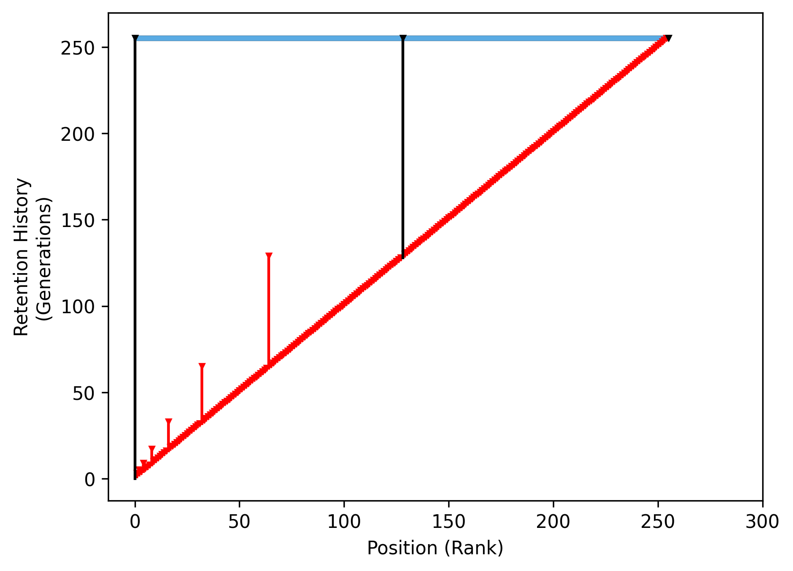
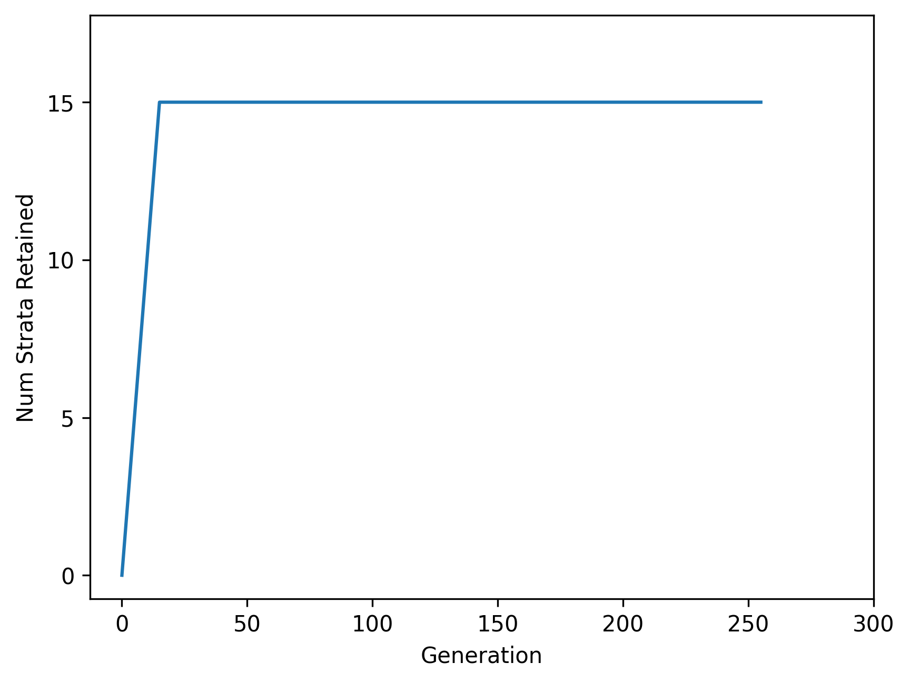

[
  
](https://pypi.python.org/pypi/hstrat)
[
  
](https://codecov.io/gh/mmore500/hstrat)
[
  ](https://www.codacy.com/gh/mmore500/hstrat/dashboard?utm_source=github.com&amp;utm_medium=referral&amp;utm_content=mmore500/hstrat&amp;utm_campaign=Badge_Grade)
[
  
](https://github.com/mmore500/hstrat/actions)
[
  
](https://hstrat.readthedocs.io/en/latest/?badge=latest)
[
  ](https://github.com/mmore500/hstrat
)

hstrat enables phylogenetic inference on distributed digital evolution populations

* Free software: MIT license
* Documentation: <https://hstrat.readthedocs.io>

## Install

`python3 -m pip install hstrat`

## Usage

```python3
from hstrat import hstrat

stratum_retention_policy = hstrat.geom_seq_nth_root_tapered_policy.Policy(
    parameterizer=hstrat.PropertyAtMostParameterizer(
        target_value=127,
        policy_evaluator \
            =hstrat.MrcaUncertaintyAbsExactPolicyEvaluator(
                at_num_strata_deposited=256,
                at_rank=0,
        ),
        param_lower_bound=1,
        param_upper_bound=1024,
    )
)

individual1 = hstrat.HereditaryStratigraphicColumn(
    stratum_retention_policy=stratum_retention_policy,
)
individual2 = hstrat.HereditaryStratigraphicColumn(
  stratum_retention_policy=stratum_retention_policy,
)

individual1_child1 = individual1.CloneDescendant()

individual1.HasAnyCommonAncestorWith(individual2) # -> False
individual1_child1.HasAnyCommonAncestorWith(individual2) # -> False

individual1_grandchild1 = individual1_child1.CloneDescendant()
individual1_grandchild2 = individual1_child1.CloneDescendant()

individual1_grandchild1.CalcRankOfMrcaBoundsWith(
  individual1_grandchild2,
) # -> (1, 2)
```


## How it Works


## Retention Drip Plot Visualization

| No History | Retained History | All History |
|------------|------------------|-------------|
|  |  |  |

## Available Stratum Retention Policies

| Policy                                 | Space Complexity | MRCA Gen Uncertainty |
|----------------------------------------|------------------|----------------------|
| Fixed Resolution Policy                | `n/k`            | `k`                  |
| Recency Proportional Resolution Policy | `k * log(n)`     | `m/k`                |
| Depth Proportional Resolution Policy   | `k`              | `n/k`                |
| Geometric Sequence Nth Root Policy     | `k`              | `m * n^(1/k)`        |

where `n` is generations elapsed, `m` is generations since MRCA, and `k` is an arbitrary user-determined constant.

End users can also define custom stratum retention policies.

### Depth Proportional Resolution Policy

| Sparse Parameterization | Dense Parameterization |
|-------------------------|------------------------|
|  |  |
|  |  |

| Dense Parameterization Detail | | |
| ------------------------------|-|-|
|  |  |  |

### Tapered Depth Proportional Resolution Policy

| Sparse Parameterization | Dense Parameterization |
|-------------------------|------------------------|
|  |  |
|  |  |

| Dense Parameterization Detail | | |
| ------------------------------|-|-|
|  |  |  |

### Fixed Resolution Policy

| Sparse Parameterization | Dense Parameterization |
|-------------------------|------------------------|
|  |  |
|  |  |

| Dense Parameterization Detail | | |
| ------------------------------|-|-|
 |  |  |

### Geometric Sequence Nth Root Policy

| Sparse Parameterization | Dense Parameterization |
|-------------------------|------------------------|
|  |  |
|  |  |

| Dense Parameterization Detail | | |
| ------------------------------|-|-|
|  |  |  |

### Tapered Geometric Sequence Nth Root Policy

| Sparse Parameterization | Dense Parameterization |
|-------------------------|------------------------|
|  | 
|  |  |

| Dense Parameterization Detail | | |
| ------------------------------|-|-|
|  |  |  |

### Recency Proportional Resolution Policy

| Sparse Parameterization | Dense Parameterization |
|-------------------------|------------------------|
|  |  |
|  |  |

| Dense Parameterization Detail | | |
| ------------------------------|-|-|
|  |  |   |

### Other Policies

* nominal resolution policy
* perfect resolution policy
* pseudostochastic policy
* stochastic policy

## Available Parameterizers

* `PropertyAtMostParameterizer`
* `PropertyAtLeastParameterizer`
* `PropertyExactlyParameterizer`


* `MrcaUncertaintyAbsExactPolicyEvaluator`
* `MrcaUncertaintyAbsUpperBoundPolicyEvaluator`
* `MrcaUncertaintyRelExactPolicyEvaluator`
* `MrcaUncertaintyRelUpperBoundPolicyEvaluator`
* `NumStrataRetainedExactPolicyEvaluator`
* `NumStrataRetainedUpperBoundPolicyEvaluator`

## Credits

This package was created with Cookiecutter and the `audreyr/cookiecutter-pypackage` project template.

## hcat


