## Choosing a Retention Policy
The space-vs-resolution and distribution-of-resolution trade-offs of library-provided stratum retention algorithms are summarized below.

| Stratum Retention Algorithm               | Space Complexity | MRCA Gen Uncertainty |
| ----------------------------------------- | ---------------- | -------------------- |
| Fixed Resolution Algorithm                | `n/k`            | `k`                  |
| Recency-proportional Resolution Algorithm | `k * log(n)`     | `m/k`                |
| Depth-proportional Resolution Algorithm   | `k`              | `n/k`                |
| Geometric Sequence Nth Root Algorithm     | `k`              | `m * n^(1/k)`        |
| Curbed Recency-proportional Resolution Algorithm | `k`     | `m / k` -> `m * n^(1/k)` |

where `n` is generations elapsed, `m` is generations since MRCA, and `k` is an arbitrary user-determined constant.

Note that distribution-of-resolution trade-offs are described via the definition of uncertainty bounds in terms of generations since MRCA `m` versus overall generations elapsed `n`.

The `hstrat` library includes a suite of variants for several of these stratum retention algorithms.
These variants differ in terms of secondary considerations, for example whether column size exactly traces the asymptotic guarantee or fluctuates around it.
Computational intensity to calculate the set of strata to be dropped at each generation may also differ between variants.

The next sections tour available stratum retention algorithms in detail.

### Retention Drip Plot Visualization

| No History                                                                                                                                                                                                                                                                                                                                                                                                                                                         | Retained History                                                                                                                                                                                                                                                                                                                                                                                                                                                  | All History                                                                                                                                                                                                                                                                                                                                                                                                                                                       |
| ------------------------------------------------------------------------------------------------------------------------------------------------------------------------------------------------------------------------------------------------------------------------------------------------------------------------------------------------------------------------------------------------------------------------------------------------------------------ | ----------------------------------------------------------------------------------------------------------------------------------------------------------------------------------------------------------------------------------------------------------------------------------------------------------------------------------------------------------------------------------------------------------------------------------------------------------------- | ----------------------------------------------------------------------------------------------------------------------------------------------------------------------------------------------------------------------------------------------------------------------------------------------------------------------------------------------------------------------------------------------------------------------------------------------------------------- |
|  | [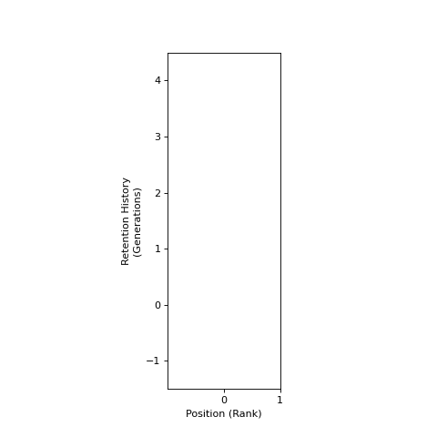](assets/a=stratum_retention_dripplot+extant_history=True+extinct_history=False+extinct_placeholders=True+num_generations=256+policy=tapered-depth-proportional-resolution-stratum-retention-algorithm-resolution-4+ext=.gif) |  |

Because stratum retention policies unfold across space and time (i.e., the location of pruned strata and the generations at which they are pruned), the retention drip plot visualizations we use to depict them require a bit of explanation to get up to speed with.
This section builds up the visualizations step-by-step in the table above.
(Note that the animations loop at 256 generations; if you are impatient you can refresh the page to restart the animations.)

The leftmost column animates the evolution of a single hereditary stratigraphic column over generations with no historical overlay.
The column itself is shown "tipped over," appearing as a horizontal blue rectangle.
Upside-down triangles are stratum within the column.
The position of strata in the `x` dimension correspond to the generation of their deposition; new strata are appended on the right.
Retention status is depicted with color.
Black strata are retained and red strata have been pruned.

The center column uses the `y` dimension to introduce historical traces for retained strata.
The line below each retained stratum spans from the generation it was deposited to the current generation.
Note that the column itself is positioned at the current generation at the top of the diagram.

Finally, the rightmost column further layers on historical traces of pruned strata.
Instead of having their trace deleted when pruned, their trace is turned red and frozen in place.
So, red traces span from the generation a pruned stratum was deposited to the generation it was pruned.

Animated panels below situate this visualization alongside additional graphs depicting absolute and relative estimation error across possible MRCA generations as well as relative and absolute column size (i.e., number of strata retained).
Two policy instantiations are visualized for each algorithm --- one yielded from a sparse parameterization and the other from a dense parameterization (i.e., one configured to retain fewer strata and one configured to retain more).

### Depth Proportional Resolution Algorithm

The depth proportional resolution algorithm drops half of retained strata when a threshold size cap is met in order to maintain `O(1)` space complexity.
Retained strata are evenly spaced.

| Sparse Parameterization                                                                                                                                                                                                                                                                                                | Dense Parameterization                                                                                                                                                                                                                                                                                                 |
| ---------------------------------------------------------------------------------------------------------------------------------------------------------------------------------------------------------------------------------------------------------------------------------------------------------------------- | ---------------------------------------------------------------------------------------------------------------------------------------------------------------------------------------------------------------------------------------------------------------------------------------------------------------------- |
|             |             |
| [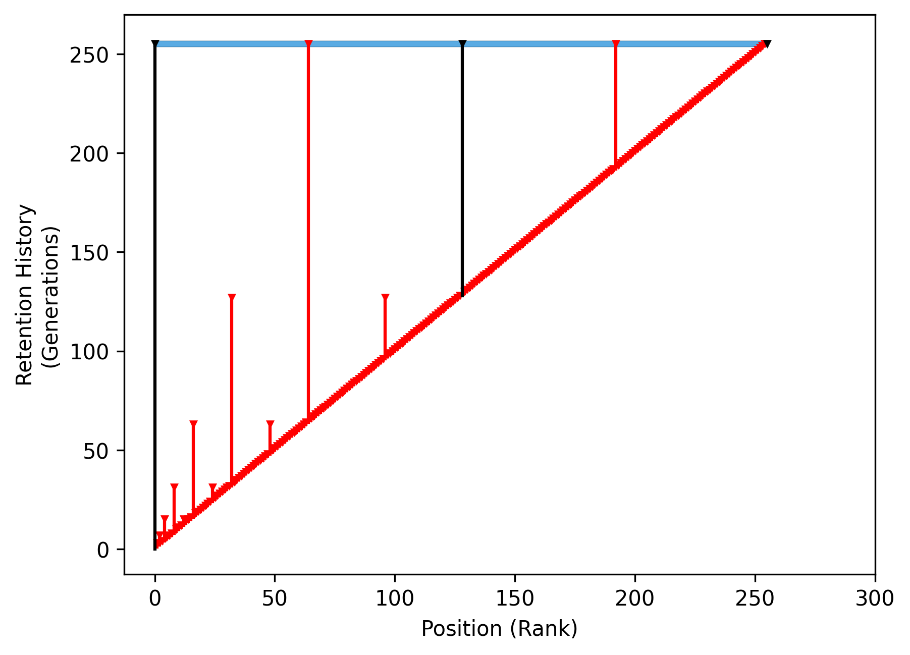](assets/num_generations=256+policy=depth-proportional-resolution-stratum-retention-algorithm-resolution-2+viz=stratum-retention-dripplot+ext=.png) | [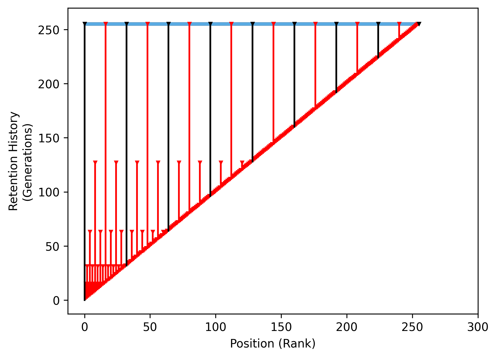](assets/num_generations=256+policy=depth-proportional-resolution-stratum-retention-algorithm-resolution-8+viz=stratum-retention-dripplot+ext=.png) |

#### Dense Parameterization Detail
| Num Strata Retained                                                                                                                                                                                                                                                                                            | Absolute MRCA Uncertainty by Position                                                                                                                                                                                                                                                                                                                              | Relative MRCA Uncertainty by Position                                                                                                                                                                                                                                                                                         |
| ------------------------------------------------------------------------------------------------------------------------------------------------------------------------------------------------------------------------------------------------------------------------------------------------------------------------ | ----------------------------------------------------------------------------------------------------------------------------------------------------------------------------------------------------------------------------------------------------------------------------------------------------------------------------- | ----------------------------------------------------------------------------------------------------------------------------------------------------------------------------------------------------------------------------------------------------------------------------------------------------------------------------- |
| [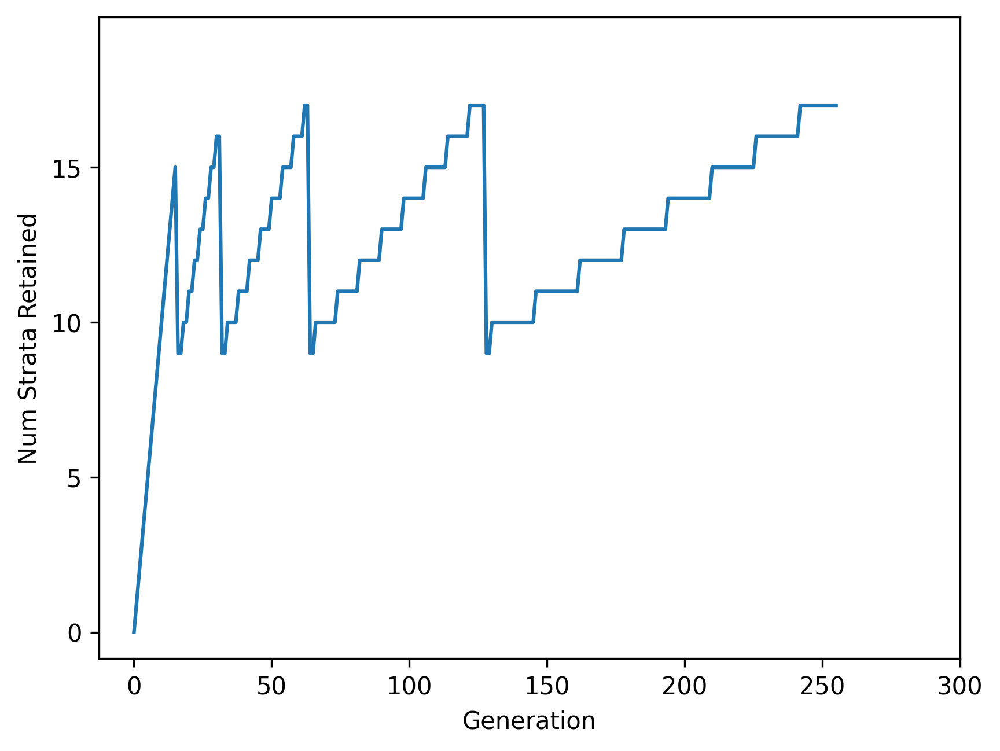](assets/num_generations=256+policy=depth-proportional-resolution-stratum-retention-algorithm-resolution-8+viz=strata-retained-num-lineplot+ext=.png) | [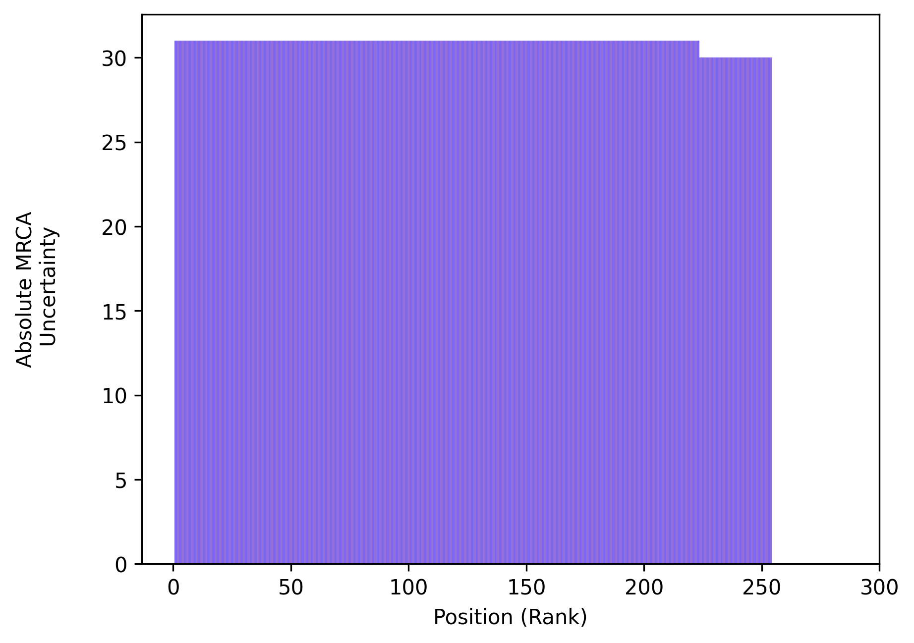](assets/num_generations=256+policy=depth-proportional-resolution-stratum-retention-algorithm-resolution-8+viz=mrca-uncertainty-absolute-barplot+ext=.png) | [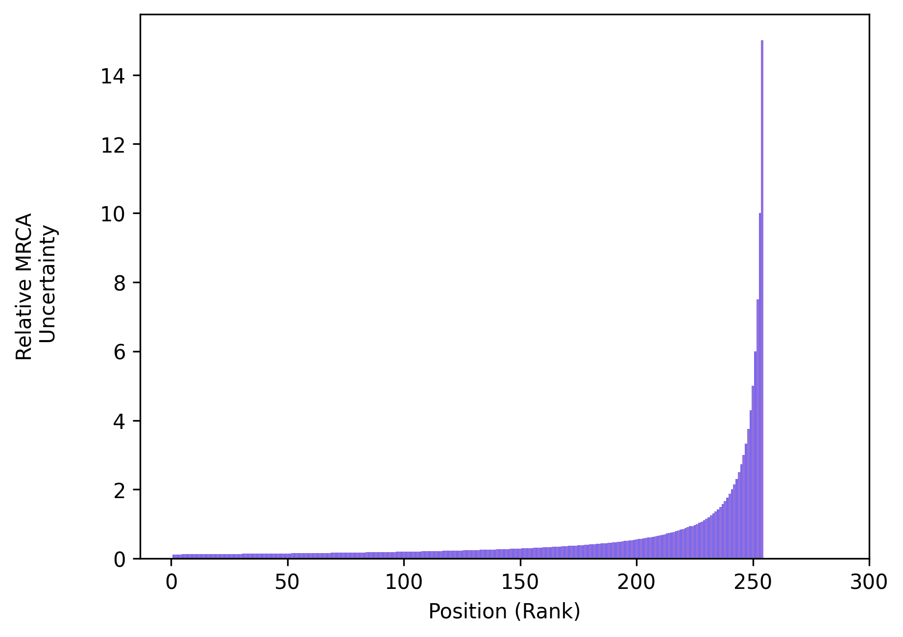](assets/num_generations=256+policy=depth-proportional-resolution-stratum-retention-algorithm-resolution-8+viz=mrca-uncertainty-relative-barplot+ext=.png) |

### Tapered Depth Proportional Resolution Algorithm

The tapered depth proportional resolution algorithm drops strata gradually from the rear once the threshold size cap is met (instead of purging half of strata all at once).

| Sparse Parameterization                                                                                                                                                                                                                                                                                                        | Dense Parameterization                                                                                                                                                                                                                                                                                                         |
| ------------------------------------------------------------------------------------------------------------------------------------------------------------------------------------------------------------------------------------------------------------------------------------------------------------------------------ | ------------------------------------------------------------------------------------------------------------------------------------------------------------------------------------------------------------------------------------------------------------------------------------------------------------------------------ |
|             |             |
| [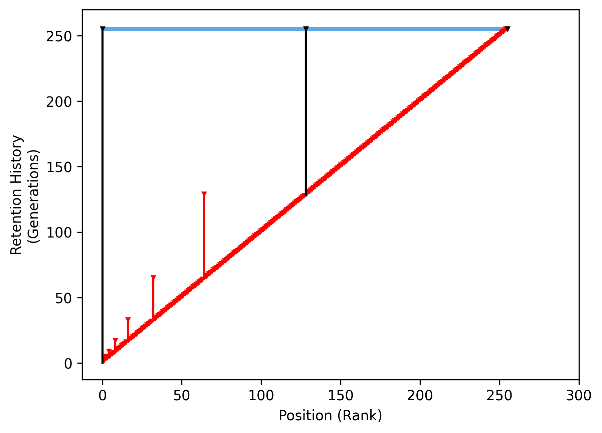](assets/num_generations=256+policy=tapered-depth-proportional-resolution-stratum-retention-algorithm-resolution-1+viz=stratum-retention-dripplot+ext=.png) | [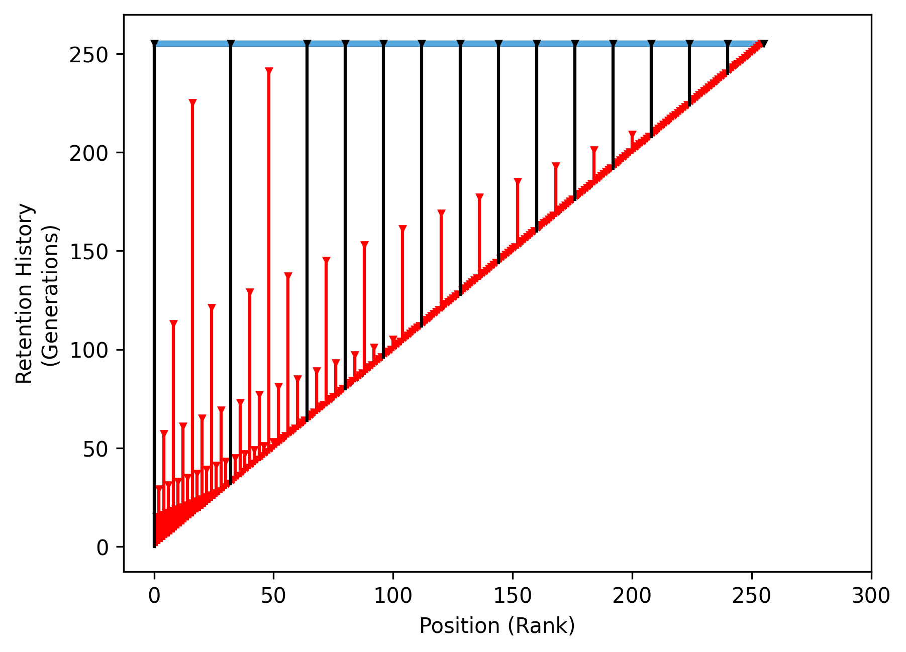](assets/num_generations=256+policy=tapered-depth-proportional-resolution-stratum-retention-algorithm-resolution-7+viz=stratum-retention-dripplot+ext=.png) |

#### Dense Parameterization Detail
| Num Strata Retained                                                                                                                                                                                                                                                                                            | Absolute MRCA Uncertainty by Position                                                                                                                                                                                                                                                                                                                              | Relative MRCA Uncertainty by Position                                                                                                                                                                                                                                                                                         |
| -------------------------------------------------------------------------------------------------------------------------------------------------------------------------------------------------------------------------------------------------------------------------------------------------------------------------------- | ------------------------------------------------------------------------------------------------------------------------------------------------------------------------------------------------------------------------------------------------------------------------------------------------------------------------------------- | ------------------------------------------------------------------------------------------------------------------------------------------------------------------------------------------------------------------------------------------------------------------------------------------------------------------------------------- |
| [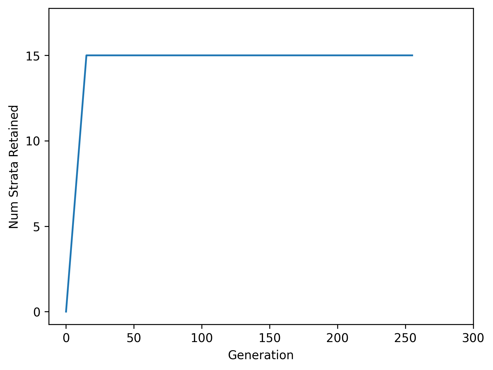](assets/num_generations=256+policy=tapered-depth-proportional-resolution-stratum-retention-algorithm-resolution-7+viz=strata-retained-num-lineplot+ext=.png) | [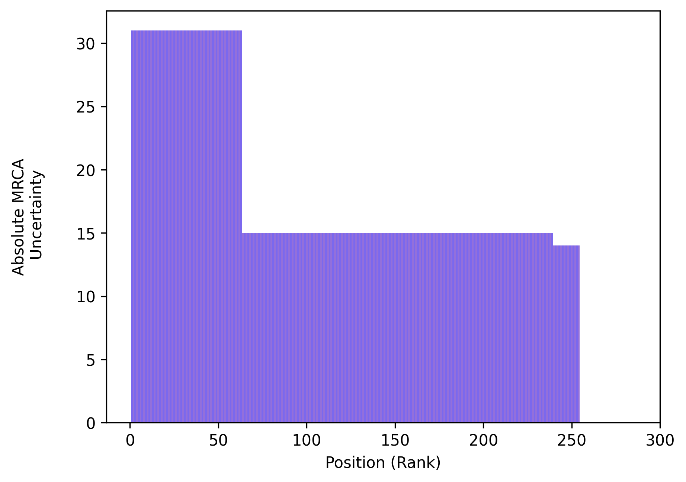](assets/num_generations=256+policy=tapered-depth-proportional-resolution-stratum-retention-algorithm-resolution-7+viz=mrca-uncertainty-absolute-barplot+ext=.png) | [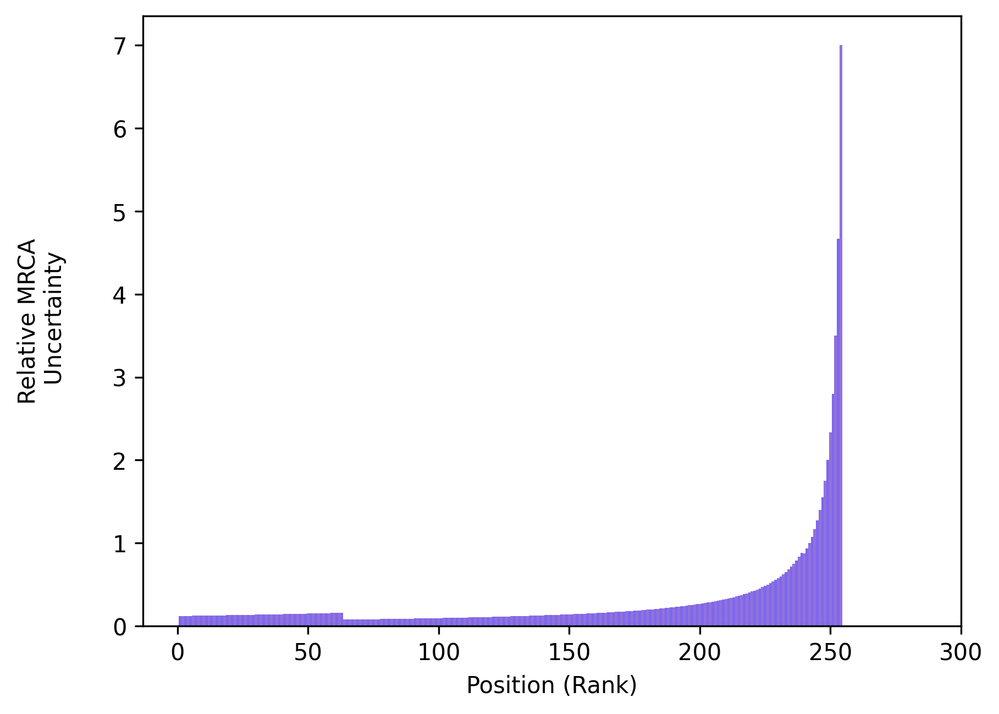](assets/num_generations=256+policy=tapered-depth-proportional-resolution-stratum-retention-algorithm-resolution-7+viz=mrca-uncertainty-relative-barplot+ext=.png) |

### Fixed Resolution Algorithm

The fixed resolution algorithm permanently retains every `n`th stratum, giving it linear `O(n)` space complexity and uniform distribution of retained strata.

| Sparse Parameterization                                                                                                                                                                                                                                                                                     | Dense Parameterization                                                                                                                                                                                                                                                                                     |
| ----------------------------------------------------------------------------------------------------------------------------------------------------------------------------------------------------------------------------------------------------------------------------------------------------------- | ---------------------------------------------------------------------------------------------------------------------------------------------------------------------------------------------------------------------------------------------------------------------------------------------------------- |
|             |             |
| [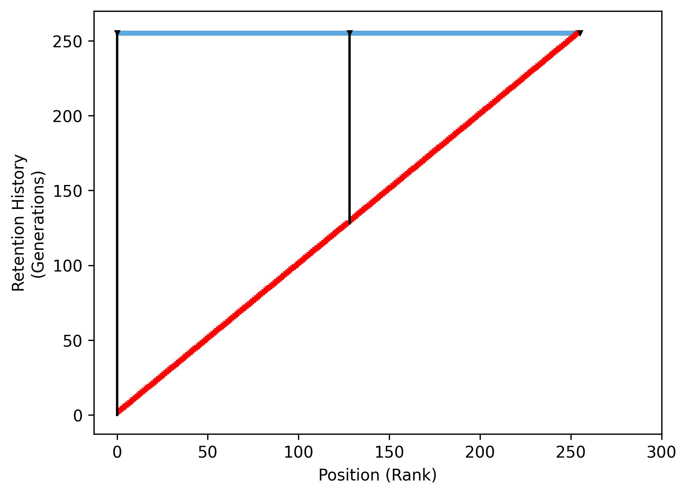](assets/num_generations=256+policy=fixed-resolution-stratum-retention-algorithm-resolution-128+viz=stratum-retention-dripplot+ext=.png) | [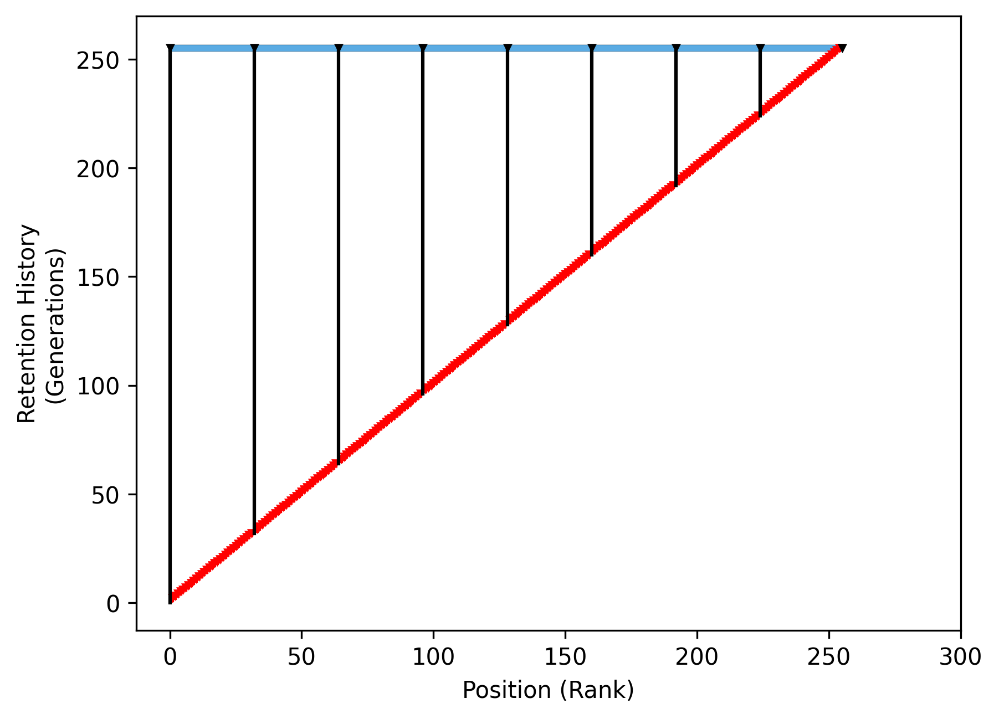](assets/num_generations=256+policy=fixed-resolution-stratum-retention-algorithm-resolution-32+viz=stratum-retention-dripplot+ext=.png) |

#### Dense Parameterization Detail
| Num Strata Retained                                                                                                                                                                                                                                                                                            | Absolute MRCA Uncertainty by Position                                                                                                                                                                                                                                                                                                                              | Relative MRCA Uncertainty by Position                                                                                                                                                                                                                                                                                         |
| ------------------------------------------------------------------------------------------------------------------------------------------------------------------------------------------------------------------------------------------------------------------------------------------------------------ | ----------------------------------------------------------------------------------------------------------------------------------------------------------------------------------------------------------------------------------------------------------------------------------------------------------------- | ----------------------------------------------------------------------------------------------------------------------------------------------------------------------------------------------------------------------------------------------------------------------------------------------------------------- |
| [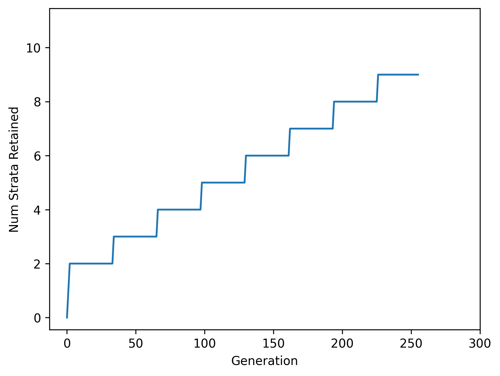](assets/num_generations=256+policy=fixed-resolution-stratum-retention-algorithm-resolution-32+viz=strata-retained-num-lineplot+ext=.png) |  | [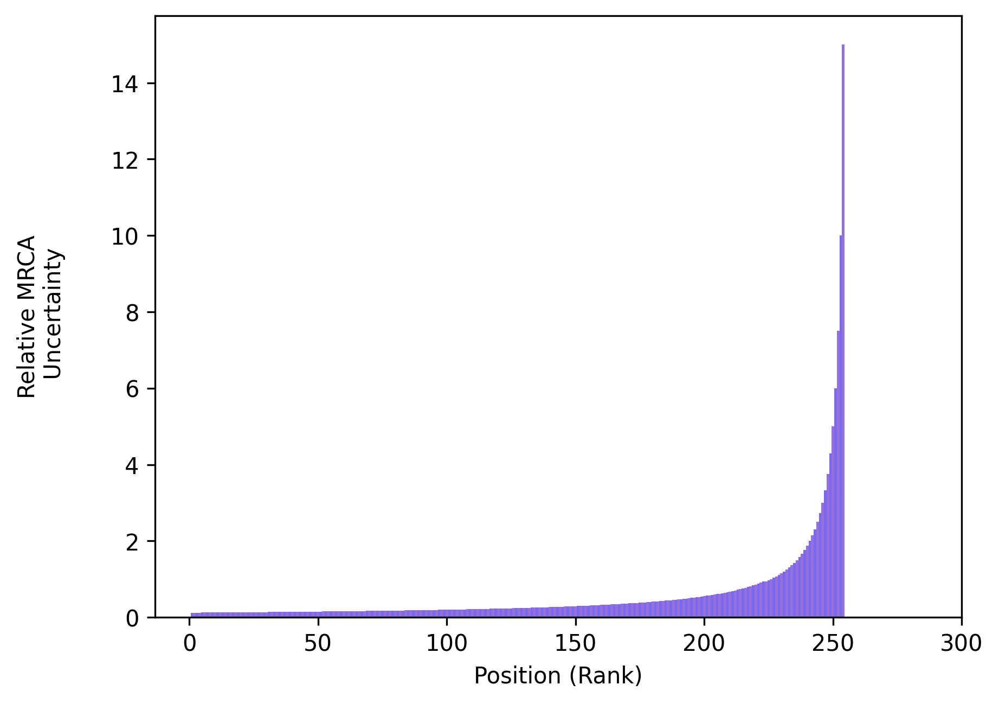](assets/num_generations=256+policy=fixed-resolution-stratum-retention-algorithm-resolution-32+viz=mrca-uncertainty-relative-barplot+ext=.png) |

### Geometric Sequence Nth Root Algorithm

The geometric sequence algorithm provides constant `O(1)` space complexity with recency-proportional distribution of retained strata.
To accomplish this, a fixed number `k` of fixed-cardinality subcomponents track `k` waypoints exponentially spaced backward from the most-recent stratum (i.e., spaced corresponding to the roots `0/k`, `1/k`, `2/k`, ..., `k/k`).

| Sparse Parameterization                                                                                                                                                                                                                                                                                                         | Dense Parameterization                                                                                                                                                                                                                                                                                                             |
| ------------------------------------------------------------------------------------------------------------------------------------------------------------------------------------------------------------------------------------------------------------------------------------------------------------------------------- | ---------------------------------------------------------------------------------------------------------------------------------------------------------------------------------------------------------------------------------------------------------------------------------------------------------------------------------- |
|             |             |
|  | [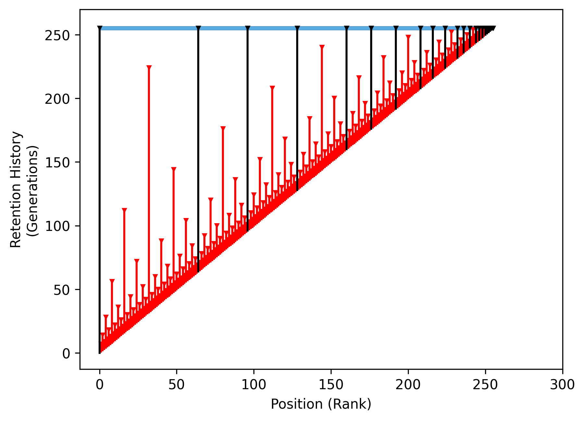](assets/num_generations=256+policy=nth-root-geometric-sequence-stratum-retention-algorithm-degree-1024-interspersal-2+viz=stratum-retention-dripplot+ext=.png) |

#### Dense Parameterization Detail
| Num Strata Retained                                                                                                                                                                                                                                                                                            | Absolute MRCA Uncertainty by Position                                                                                                                                                                                                                                                                                                                              | Relative MRCA Uncertainty by Position                                                                                                                                                                                                                                                                                         |
| ------------------------------------------------------------------------------------------------------------------------------------------------------------------------------------------------------------------------------------------------------------------------------------------------------------------------------------ | ----------------------------------------------------------------------------------------------------------------------------------------------------------------------------------------------------------------------------------------------------------------------------------------------------------------------------------------- | ----------------------------------------------------------------------------------------------------------------------------------------------------------------------------------------------------------------------------------------------------------------------------------------------------------------------------------------- |
| [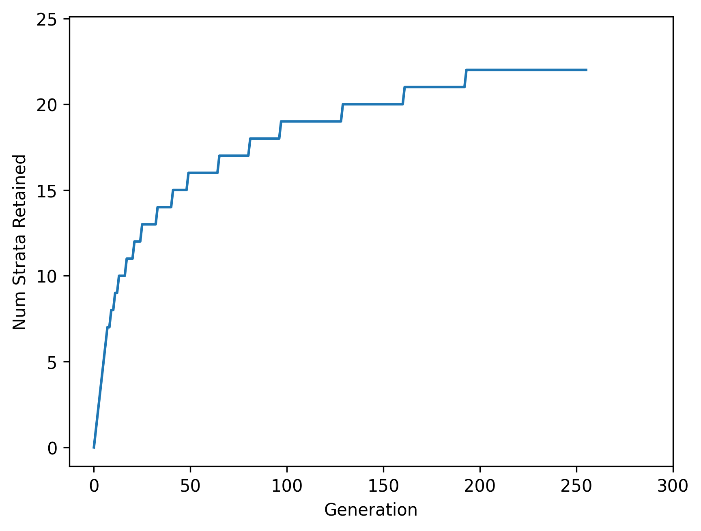](assets/num_generations=256+policy=nth-root-geometric-sequence-stratum-retention-algorithm-degree-1024-interspersal-2+viz=strata-retained-num-lineplot+ext=.png) | [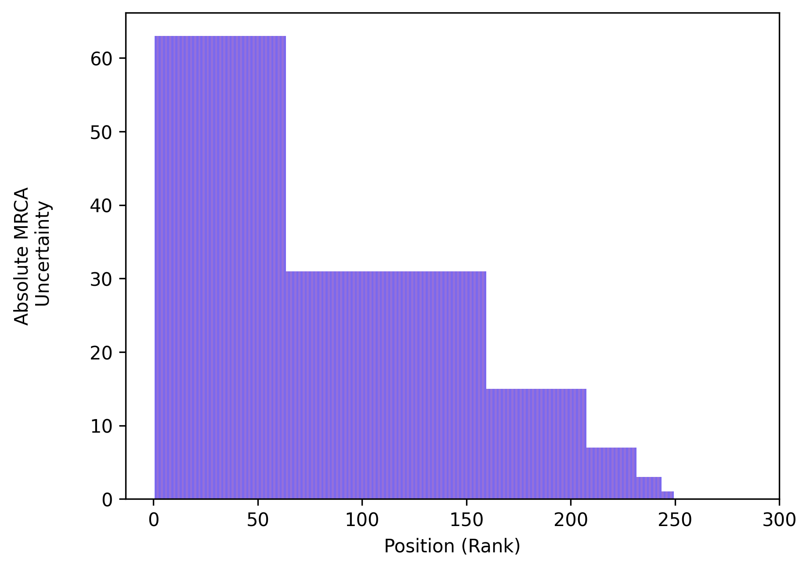](assets/num_generations=256+policy=nth-root-geometric-sequence-stratum-retention-algorithm-degree-1024-interspersal-2+viz=mrca-uncertainty-absolute-barplot+ext=.png) | [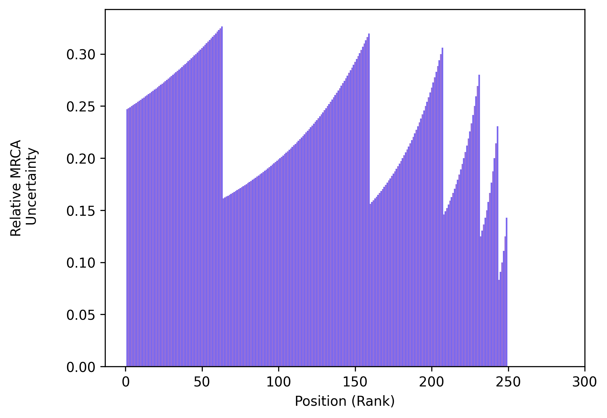](assets/num_generations=256+policy=nth-root-geometric-sequence-stratum-retention-algorithm-degree-1024-interspersal-2+viz=mrca-uncertainty-relative-barplot+ext=.png) |

### Tapered Geometric Sequence Nth Root Algorithm

The tapered geometric sequence nth root algorithm maintains exactly-constant size at its vanilla counterpart's upper bound instead of fluctuating below that bound.
It is more computationally expensive than the vanilla geometric sequence nth root algorithm.

| Sparse Parameterization                                                                                                                                                                                                                                                                                                                 | Dense Parameterization                                                                                                                                                                                                                                                                                                                  |
| --------------------------------------------------------------------------------------------------------------------------------------------------------------------------------------------------------------------------------------------------------------------------------------------------------------------------------------- | --------------------------------------------------------------------------------------------------------------------------------------------------------------------------------------------------------------------------------------------------------------------------------------------------------------------------------------- |
|             |             |
| [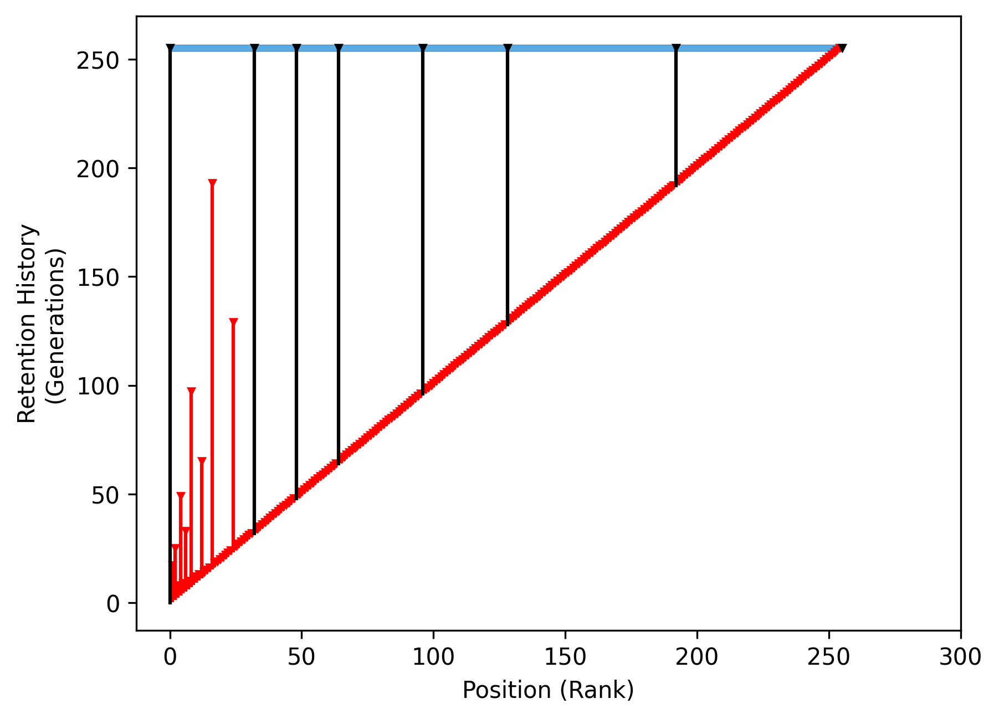](assets/num_generations=256+policy=tapered-nth-root-geometric-sequence-stratum-retention-algorithm-degree-1-interspersal-2+viz=stratum-retention-dripplot+ext=.png) | [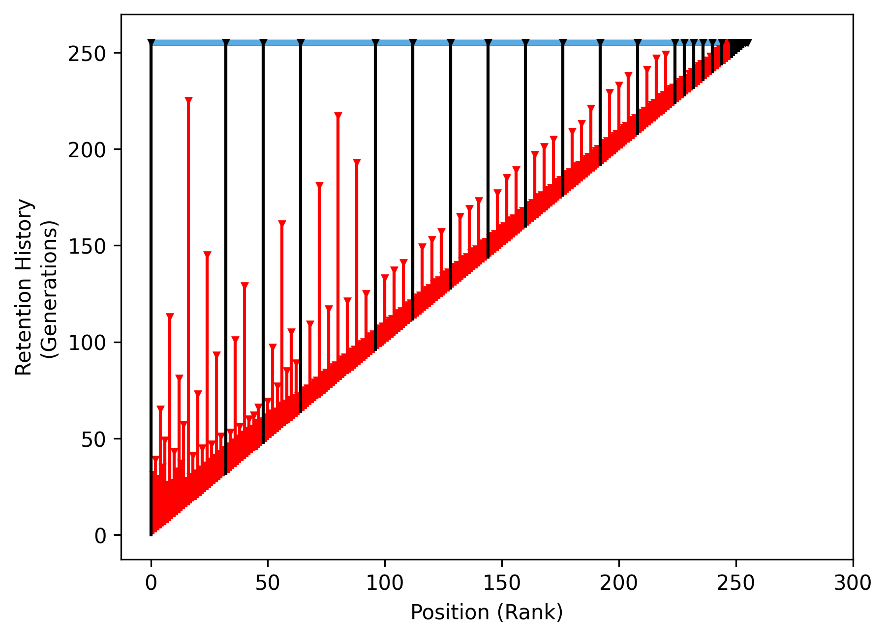](assets/num_generations=256+policy=tapered-nth-root-geometric-sequence-stratum-retention-algorithm-degree-4-interspersal-2+viz=stratum-retention-dripplot+ext=.png) |

#### Dense Parameterization Detail
| Num Strata Retained                                                                                                                                                                                                                                                                                            | Absolute MRCA Uncertainty by Position                                                                                                                                                                                                                                                                                                                              | Relative MRCA Uncertainty by Position                                                                                                                                                                                                                                                                                         |
| ----------------------------------------------------------------------------------------------------------------------------------------------------------------------------------------------------------------------------------------------------------------------------------------------------------------------------------------- | ---------------------------------------------------------------------------------------------------------------------------------------------------------------------------------------------------------------------------------------------------------------------------------------------------------------------------------------------- | ---------------------------------------------------------------------------------------------------------------------------------------------------------------------------------------------------------------------------------------------------------------------------------------------------------------------------------------------- |
| [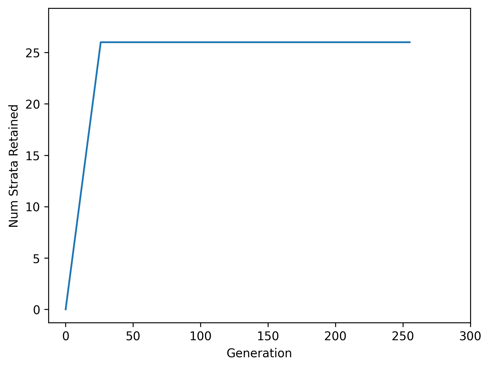](assets/num_generations=256+policy=tapered-nth-root-geometric-sequence-stratum-retention-algorithm-degree-4-interspersal-2+viz=strata-retained-num-lineplot+ext=.png) | [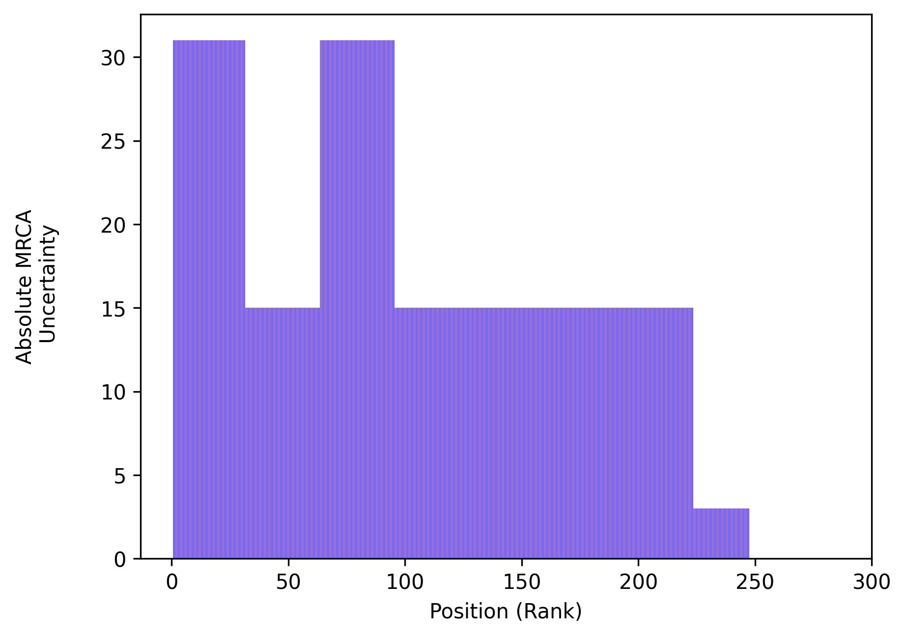](assets/num_generations=256+policy=tapered-nth-root-geometric-sequence-stratum-retention-algorithm-degree-4-interspersal-2+viz=mrca-uncertainty-absolute-barplot+ext=.png) | [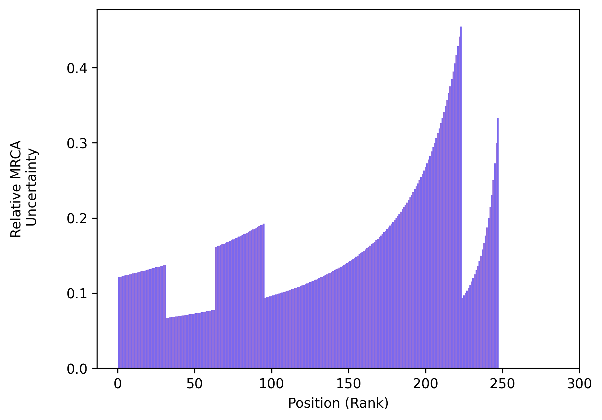](assets/num_generations=256+policy=tapered-nth-root-geometric-sequence-stratum-retention-algorithm-degree-4-interspersal-2+viz=mrca-uncertainty-relative-barplot+ext=.png) |

### Recency Proportional Resolution Algorithm

The recency proportional resolution algorithm maintains relative MRCA estimation error below a constant bound.
It exhibits logarithmic `O(log(n))` space complexity.

| Sparse Parameterization                                                                                                                                                                                                                                                                                                  | Dense Parameterization                                                                                                                                                                                                                                                                                                   |
| ------------------------------------------------------------------------------------------------------------------------------------------------------------------------------------------------------------------------------------------------------------------------------------------------------------------------ | ------------------------------------------------------------------------------------------------------------------------------------------------------------------------------------------------------------------------------------------------------------------------------------------------------------------------ |
|             |              |
| [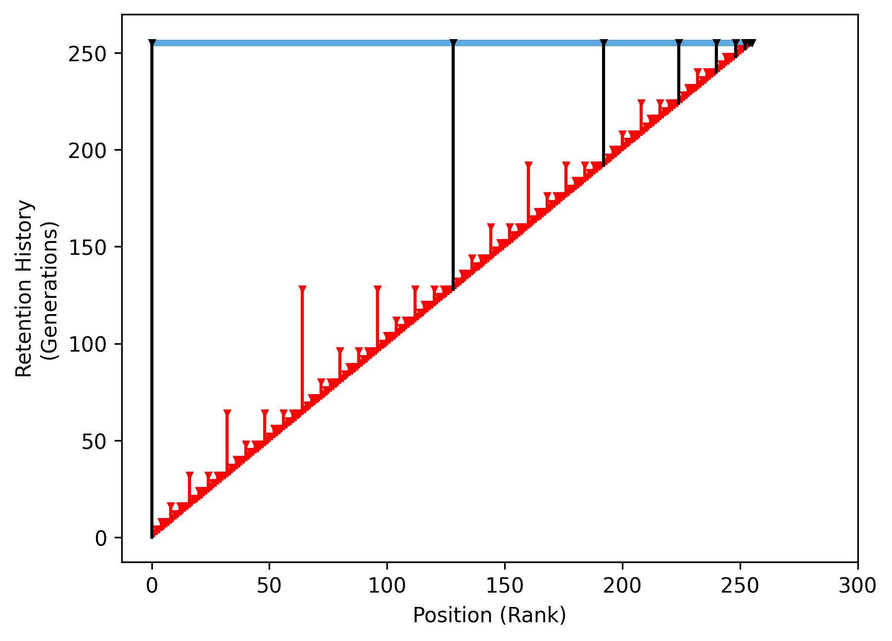](assets/num_generations=256+policy=recency-proportional-resolution-stratum-retention-algorithm-resolution-0+viz=stratum-retention-dripplot+ext=.png) | [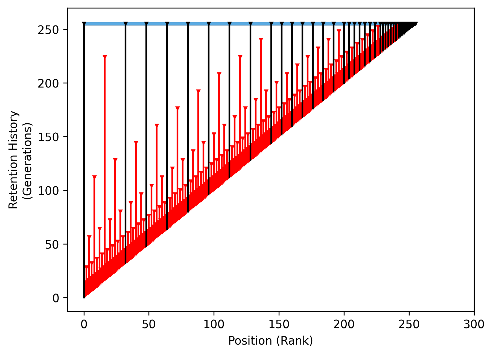](assets/num_generations=256+policy=recency-proportional-resolution-stratum-retention-algorithm-resolution-6+viz=stratum-retention-dripplot+ext=.png) |

#### Dense Parameterization Detail
| Num Strata Retained                                                                                                                                                                                                                                                                                            | Absolute MRCA Uncertainty by Position                                                                                                                                                                                                                                                                                                                              | Relative MRCA Uncertainty by Position                                                                                                                                                                                                                                                                                         |
| -------------------------------------------------------------------------------------------------------------------------------------------------------------------------------------------------------------------------------------------------------------------------------------------------------------------------- | ------------------------------------------------------------------------------------------------------------------------------------------------------------------------------------------------------------------------------------------------------------------------------------------------------------------------------- | ------------------------------------------------------------------------------------------------------------------------------------------------------------------------------------------------------------------------------------------------------------------------------------------------------------------------------- |
| [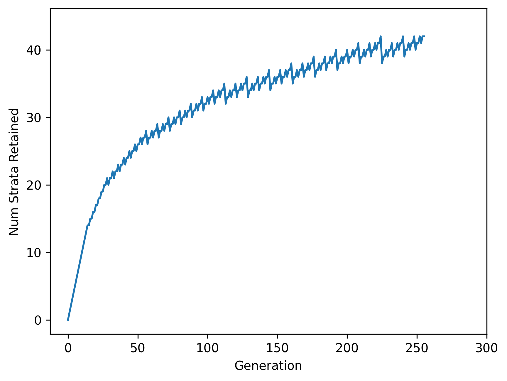](assets/num_generations=256+policy=recency-proportional-resolution-stratum-retention-algorithm-resolution-6+viz=strata-retained-num-lineplot+ext=.png) | [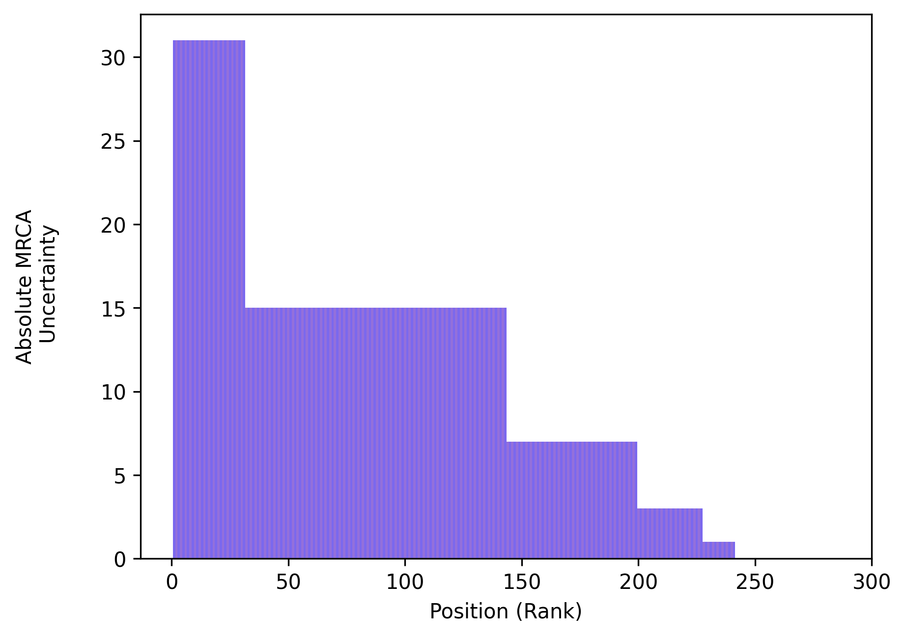](assets/num_generations=256+policy=recency-proportional-resolution-stratum-retention-algorithm-resolution-6+viz=mrca-uncertainty-absolute-barplot+ext=.png) | [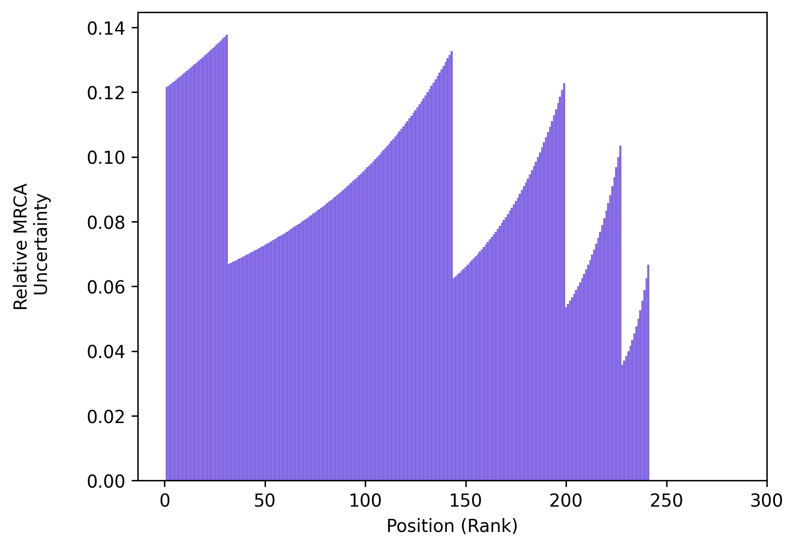](assets/num_generations=256+policy=recency-proportional-resolution-stratum-retention-algorithm-resolution-6+viz=mrca-uncertainty-relative-barplot+ext=.png) |

### Curbed Recency Proportional Resolution Algorithm

The curbed recency-proportional resolution algorithm eagerly utilize fixed stratum storage capacity to minimize recency-proportional MRCA uncertainty.

This strategy provides the finest-possible recency-proportional granularity within parameterized space constraint.
Resolution degrades gracefully as deposition history grows.

This algorithm is similar to the geometric sequence nth root algorithm in guaranteeing constant space complexity with recency-proportional MRCA uncertainty.
However, this curbed recency-proportional algorithm makes fuller (i.e., more aggressive) use of available space during early depositions.

In this way, it is similar to the tapered geometric sequence nth root algorithm during early depositions.
The tapered nth root algorithm makes fullest use of fixed available space.
In fact, it perfectly fills available space.
However, the curbed recency-proportional algorithm's space use is more effective at early time points --- it better minimizes recency-proportional MRCA uncertainty than the curbed algorithm.

| Sparse Parameterization                                                                                                                                                                                                                                                                                                  | Dense Parameterization                                                                                                                                                                                                                                                                                                   |
| ------------------------------------------------------------------------------------------------------------------------------------------------------------------------------------------------------------------------------------------------------------------------------------------------------------------------ | ------------------------------------------------------------------------------------------------------------------------------------------------------------------------------------------------------------------------------------------------------------------------------------------------------------------------ |
| [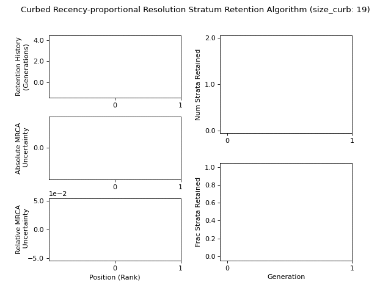](assets/a=policy_panel_plot+num_generations=256+policy=curbed-recency-proportional-resolution-stratum-retention-algorithm-size-curb-19+ext=.gif)            |              |
| [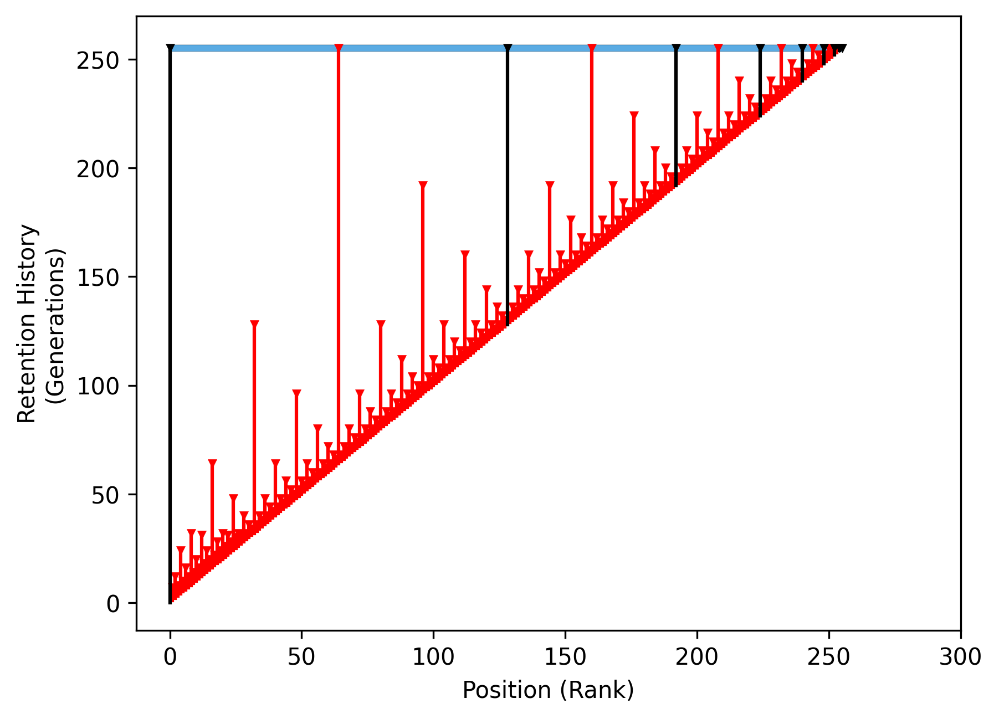](assets/num_generations=256+policy=curbed-recency-proportional-resolution-stratum-retention-algorithm-size-curb-19+viz=stratum-retention-dripplot+ext=.png) | [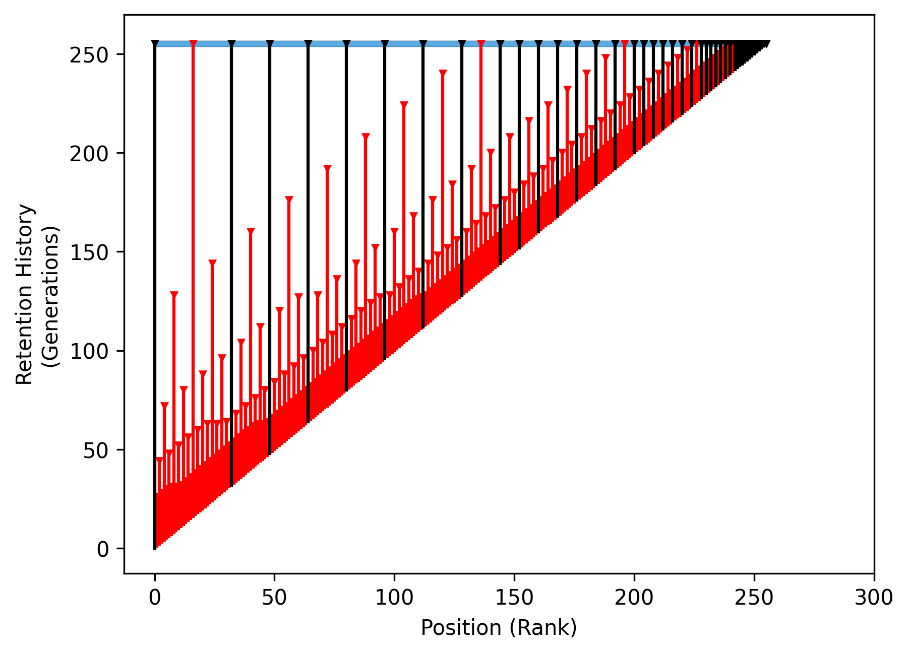](assets/num_generations=256+policy=curbed-recency-proportional-resolution-stratum-retention-algorithm-size-curb-79+viz=stratum-retention-dripplot+ext=.png) |

#### Dense Parameterization Detail
| Num Strata Retained                                                                                                                                                                                                                                                                                            | Absolute MRCA Uncertainty by Position                                                                                                                                                                                                                                                                                                                              | Relative MRCA Uncertainty by Position                                                                                                                                                                                                                                                                                         |
| -------------------------------------------------------------------------------------------------------------------------------------------------------------------------------------------------------------------------------------------------------------------------------------------------------------------------- | ------------------------------------------------------------------------------------------------------------------------------------------------------------------------------------------------------------------------------------------------------------------------------------------------------------------------------- | ------------------------------------------------------------------------------------------------------------------------------------------------------------------------------------------------------------------------------------------------------------------------------------------------------------------------------- |
| [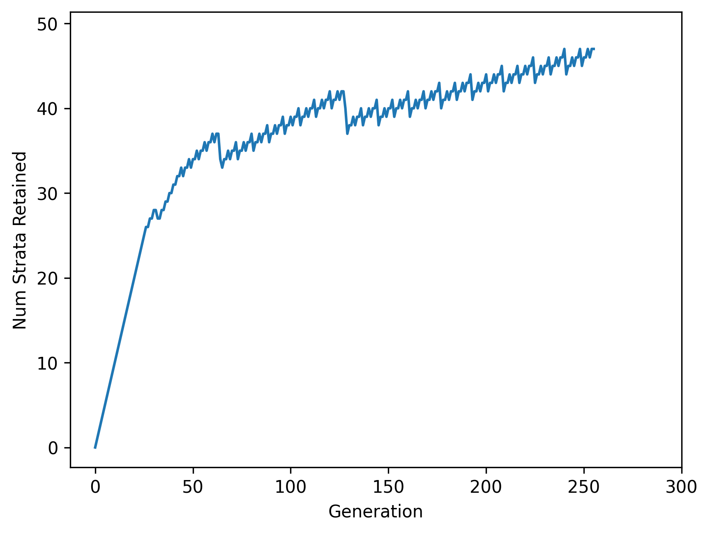](assets/num_generations=256+policy=curbed-recency-proportional-resolution-stratum-retention-algorithm-size-curb-79+viz=strata-retained-num-lineplot+ext=.png) | [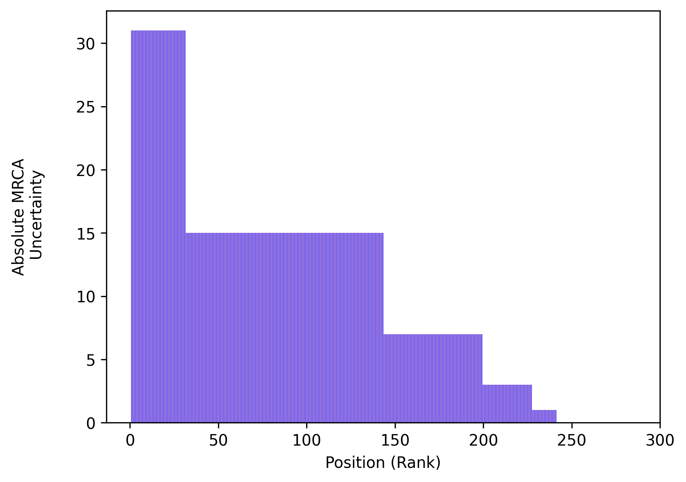](assets/num_generations=256+policy=curbed-recency-proportional-resolution-stratum-retention-algorithm-size-curb-79+viz=mrca-uncertainty-absolute-barplot+ext=.png) | [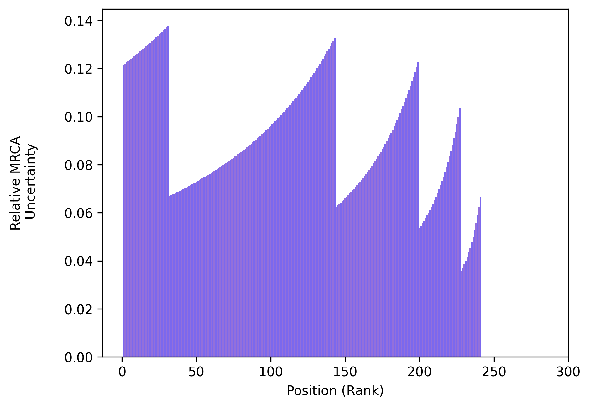](assets/num_generations=256+policy=curbed-recency-proportional-resolution-stratum-retention-algorithm-size-curb-79+viz=mrca-uncertainty-relative-barplot+ext=.png) |

This policy works by splicing together successively-sparser
`recency_proportional_resolution_algo` paramaterizations then a
permanently fixed parameterization of the `geometric_seq_nth root` algorithm.
Sparsification occurs when upper bound space use increases to exceed the fixed-size available capacity.
For a very sparse paramaterization with a size cap of eight strata, shown below, the transition to `geometric_seq_nth_root_ago` can be seen at generation 129.

| Very Sparse Parameterization | |
|------------------------------|-|
| [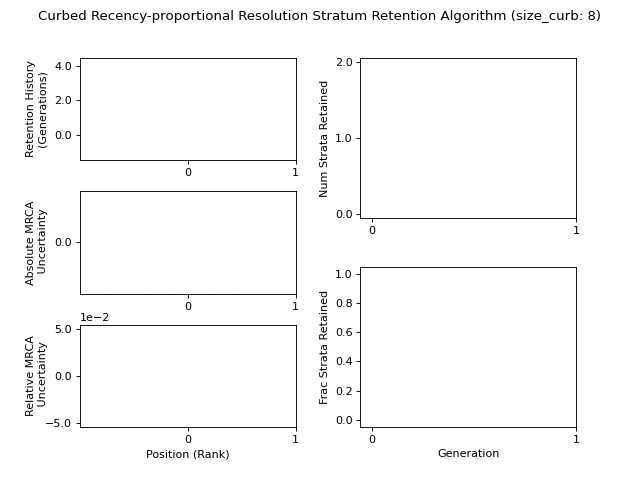](assets/a=policy_panel_plot+num_generations=256+policy=curbed-recency-proportional-resolution-stratum-retention-algorithm-size-curb-8+ext=.gif) | [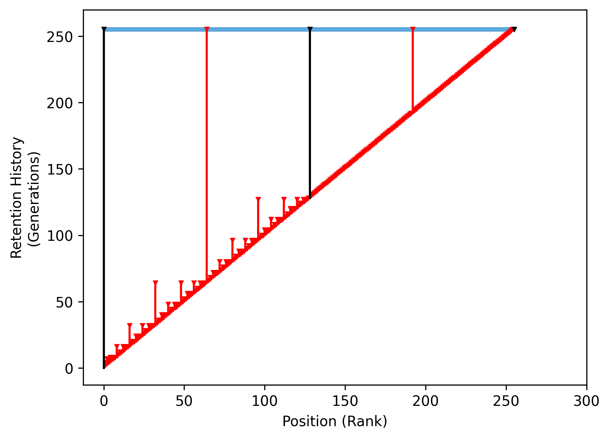](assets/num_generations=256+policy=curbed-recency-proportional-resolution-stratum-retention-algorithm-size-curb-8+viz=stratum-retention-dripplot+ext=.png) |

_Note: minor changes have been made to the transition points of the curbed-recency proportional resolution algorithm, but these older graphics best convey the underlying concept behind the algorithm._

#### Very Sparse Parameterization Detail
| Num Strata Retained                                                                                                                                                                                                                                                                                            | Absolute MRCA Uncertainty by Position                                                                                                                                                                                                                                                                                                                              | Relative MRCA Uncertainty by Position                                                                                                                                                                                                                                                                                         |
| -------------------------------------------------------------------------------------------------------------------------------------------------------------------------------------------------------------------------------------------------------------------------------------------------------------------------- | ------------------------------------------------------------------------------------------------------------------------------------------------------------------------------------------------------------------------------------------------------------------------------------------------------------------------------- | ------------------------------------------------------------------------------------------------------------------------------------------------------------------------------------------------------------------------------------------------------------------------------------------------------------------------------- |
|  | [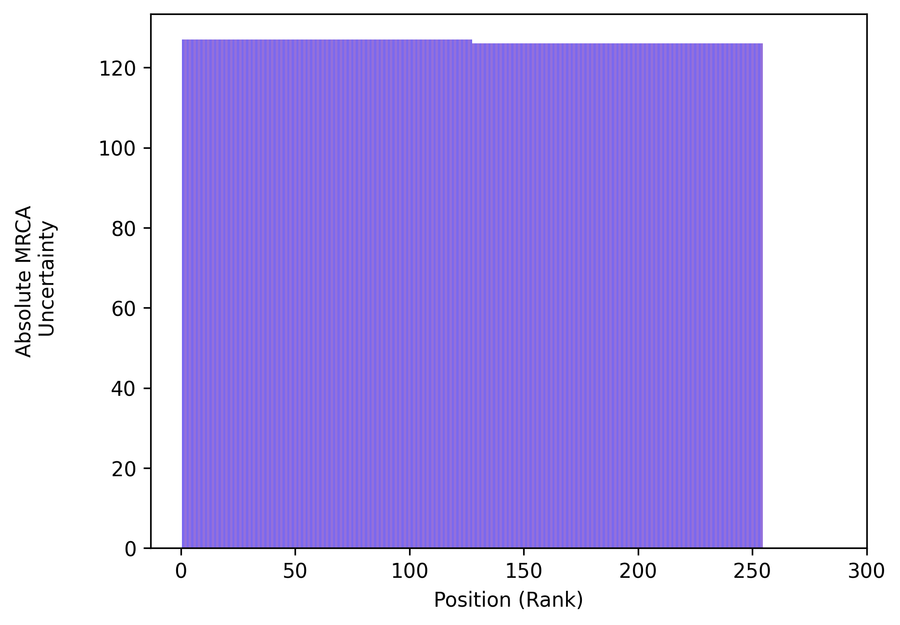](assets/num_generations=256+policy=curbed-recency-proportional-resolution-stratum-retention-algorithm-size-curb-8+viz=mrca-uncertainty-absolute-barplot+ext=.png) | [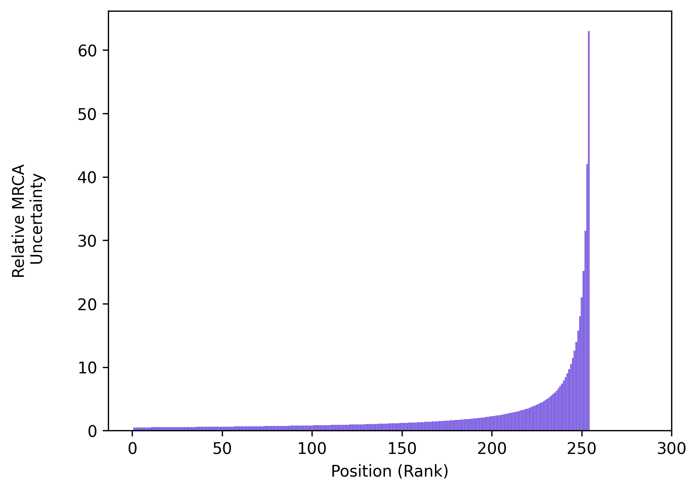](assets/num_generations=256+policy=curbed-recency-proportional-resolution-stratum-retention-algorithm-size-curb-8+viz=mrca-uncertainty-relative-barplot+ext=.png) |
